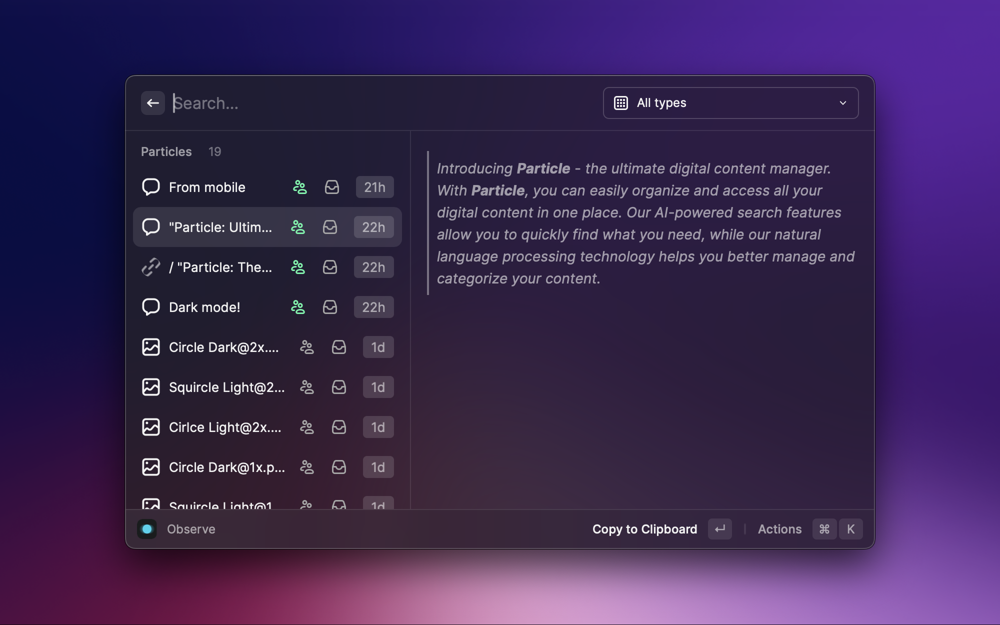
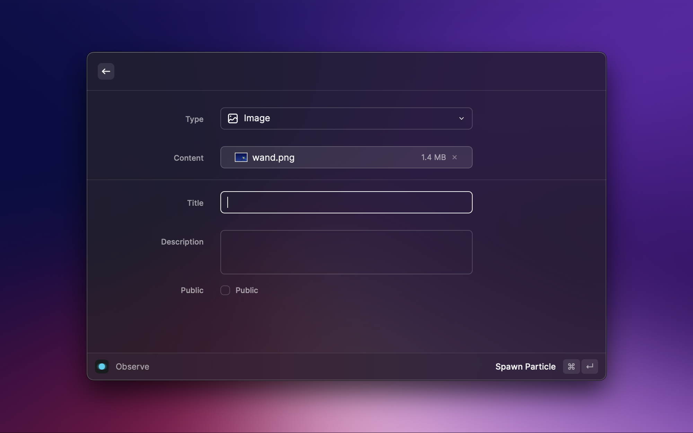
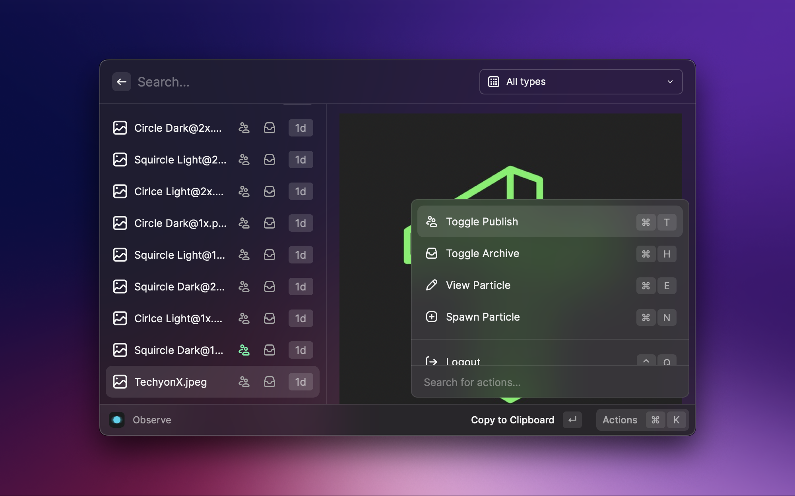

 

 

Introducing **Particle** - the ultimate digital content manager inspired by the **quantum universe**. With **Particle**, you can easily organize and access all your digital content in one place. Our AI-powered search features allow you to quickly find what you need, while our custom model helps you better manage and categorize your content.

---

 

## 🔬 Observe all your particles

In the main list, you can observe all your particles and filter them by type.

 

## 💥 Spawn new particles with ease

Spawning particles is our way of creating something new. With just a few keystrokes, you can create a link, an image, or a long text that you want to refer back to or keep track of.

\* Tip: Try selecting a text or images in Finder, and run the command `spawn` 😉

 

## 🕹️ Manage your particles

Make it observable publicly, or keep them private – your choice. If you do not need to keep track of certain particles? Archive them.

 
 

  Crafted with &nbsp; 💚 &nbsp; by <a href="https://github.com/techyonx">Techyon</a>

